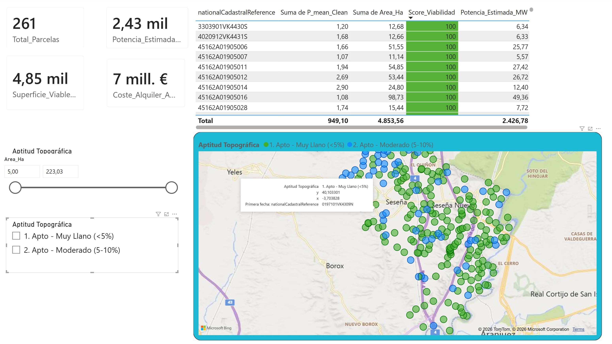

# Photovoltaic Land Viability Analysis in La Sagra (Toledo) :sun_with_face::battery:

Una herramienta de alto rendimiento de **Business Intelligence** y **SIG**, desarrollada con **Power BI** y **QGIS**, para evaluar la viabilidad técnica, geoespacial y económica de parcelas catastrales destinadas al desarrollo de parques solares fotovoltaicos en la comarca de La Sagra (Toledo, España).

Este proyecto integra el análisis espacial SIG con el modelado de datos corporativos. Va más allá de las simples coordenadas puntuales para procesar centroides catastrales en el sistema **WGS84 (EPSG:4326)**, modelando la superficie de la parcela, la topografía y parámetros financieros clave con el fin de ofrecer un panel interactivo para la selección de emplazamientos de energías renovables.

ENG

A high-performance **Business Intelligence** and **GIS** tool built with **Power BI** and **QGIS** to evaluate the technical, geospatial, and economic viability of cadastral land plots for photovoltaic solar farm development in La Sagra region (Toledo, Spain).

This project bridges GIS spatial analysis and corporate data modeling. It moves beyond simple point coordinates to process cadastral centroids in **WGS84 (EPSG:4326)**, modeling plot area, topographics, and key financial parameters to provide an interactive dashboard for renewable energy site selection.



## Tecnologías :zap:

  

[](https://skillicons.dev)

## Cómo funciona (demo) :bulb:

1. **Abre el dashboard:** Abre `powerbi/[dashboard].pbix` con **Power BI Desktop** AQUÍ.
2. **Explora el mapa:** Navega por La Sagra sobre el mapa de satélite (Bing Aerial/Hybrid) y localiza los centroides catastrales de cada parcela.
3. **Inspecciona una parcela:** Pasa el cursor o haz clic sobre cualquier centroide para ver su tooltip: referencia catastral (`nationalCadastralReference`), superficie exacta y potencia estimada.
4. **Filtra todo en tiempo real:** Tablas, KPIs y el mapa quedan sincronizados (cross-filtering) para evaluar cada emplazamiento al instante.
5. **Prioriza parcelas:** Usa el gradiente de `Score_Viabilidad` (0–100) y los colores por aptitud topográfica para preseleccionar las de alto rendimiento.

### Requisitos

- **Power BI Desktop** (para abrir/editar el `.pbix`).
- **QGIS** únicamente se usa en el preprocesamiento de datos; **no es necesario** para la demo.

## Arquitectura :building_construction:

```text
Datos catastrales (La Sagra, Toledo)
    │  Coordenadas en UTM (EPSG:25830)
    ▼
QGIS - Procesamiento Geoespacial
    │  Reproyección a WGS84 (EPSG:4326) + limpieza de datos espaciales
    ▼
Power Query (M) - Data Transformation
    │  Locale formatting y data type casting
    ▼
Power BI Data Model (DAX + Parámetros dinámicos)
    │  Potencia estimada (0.5 MWp/ha) y arrendamiento (1,500 €/ha/year)
    ▼
Score_Viabilidad (0-100) + Conditional Formatting
    │  Gradiente de color por idoneidad y clasificación topográfica
    ▼
Dashboard Interactivo (Mapas, KPIs, Tooltips, Cross-Filtering)
```

- **Datos reales:** Referencias catastrales reales, descarga pública, gratuita y oficial.
- **Escalable:** Puede aplicarse a cualquier localidad o región concreta, sólo hay que cambiar las referencias catastrales.
- **Cero fricción:** Descarga el archivo del proyecto de PowerBI y ábrelo en Power BI Desktop.

## Trabajo previo :hammer_and_wrench:

Todo este resultado es fruto del trabajo previo en **QGIS** y del posterior tratamiento de datos en **Power BI**:

- **Recorte y definición de parcelas:** Delimitación de las parcelas de interés a partir de los planos catastrales oficiales.
- **Localizaciones:** Georreferenciación y emplazamiento preciso de los centroides de cada parcela.
- **Descarga de mapas:** Obtención de ortofotos y capas base (Bing Aerial/Hybrid) junto con los datos espaciales de La Sagra.
- **Adición de buffers y reproyecciones de capas:** Generación de zonas de influencia (buffers) y reproyección de las capas a **WGS84 (EPSG:4326)**.

## Estructura del proyecto :electric_plug:

```text
Sitting-Fotovoltaico/
├── .gitignore                     # Configuración de exclusiones de Git
├── README.md                      # Documentación principal del repositorio
├── docs/
│   └── dashboard-preview.png      # Captura de pantalla del dashboard
├── data/                          # Datos catastrales procesados (EPSG:4326)
├── qgis/
│   └── [proyecto].qgz             # Proyecto QGIS con capas y simbología
└── powerbi/
    ├── [dashboard].pbix           # Modelo Power BI con medidas y DAX
    └── [conexiones].pbix          # Transformaciones Power Query (M)
```

## Resultados :vertical_traffic_light:

- <ins>Selección de emplazamientos</ins> para parques fotovoltaicos basada en datos técnicos, geoespaciales y económicos.
- Un solo <ins>dashboard interactivo</ins> para evaluar la viabilidad de cada parcela en tiempo real.
- Modelo de análisis <ins>escalable</ins> a cualquier región con datos catastrales.
- <ins>Score_Viabilidad</ins> (0-100) que prioriza de forma objetiva las parcelas de alto rendimiento.
